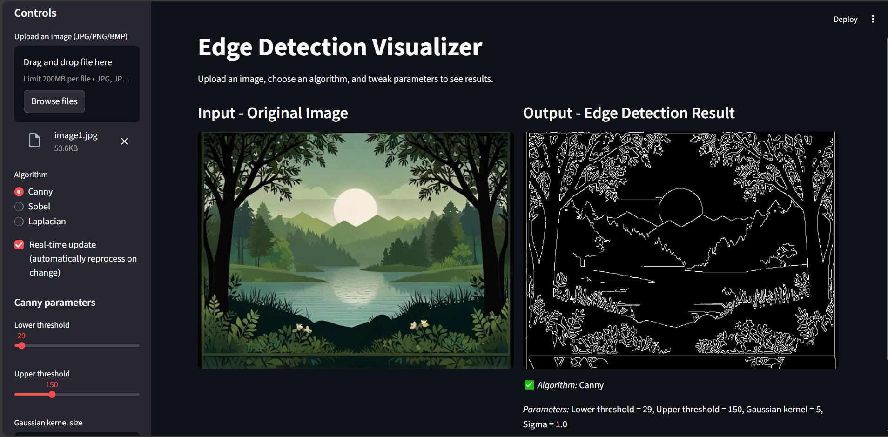
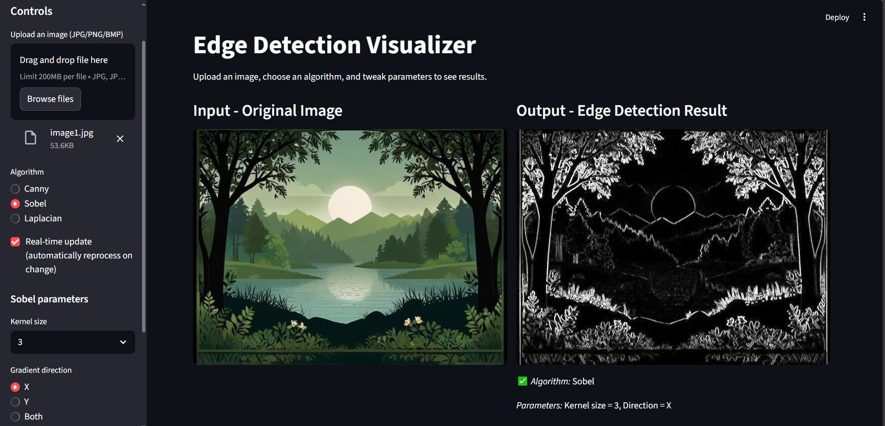
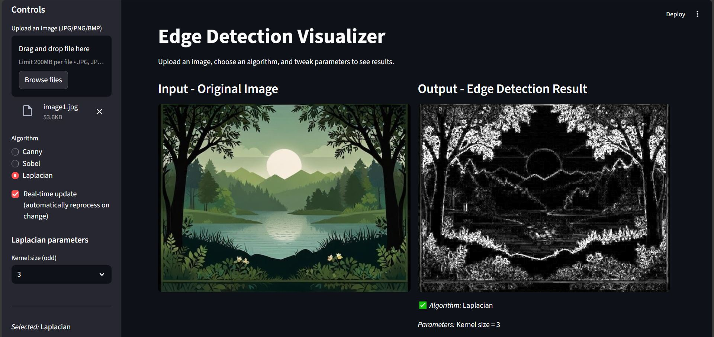

# 🖼️ Edge Detection Visualizer

**An interactive web app built with Streamlit, OpenCV, and Python**  
Upload an image, choose an algorithm, and visualize edge detection in real-time.

---

## 📖 Overview

The **Edge Detection Visualizer** is an educational and experimental web application designed to help users explore classical computer vision edge detection techniques — **Canny**, **Sobel**, and **Laplacian**.

With intuitive sliders and real-time updates, you can see how parameters like thresholds, blur, and kernel sizes affect detected edges.

---

## ✨ Features

✅ **Upload Images** — Supports `.jpg`, `.jpeg`, `.png`, and `.bmp`  
✅ **Choose Algorithms** — Canny, Sobel, or Laplacian  
✅ **Real-Time Visualization** — Automatically update as you tweak parameters  
✅ **Manual Apply Mode** — Optional "Apply" button for batch adjustments  
✅ **Side-by-Side Display** — Compare the original and processed images instantly  
✅ **Dynamic Parameter Summary** — Displays current algorithm and settings  

---

## ⚙️ Installation & Setup

### 1️⃣ Clone the Repository
```bash
git clone https://github.com/yourusername/edge-detector.git
cd edge-detector
```
### 2️⃣ (Optional) Create a Virtual Environment
```python -m venv venv
# On Windows
venv\Scripts\activate
# On macOS/Linux
source venv/bin/activate
```
### 3️⃣ Install Dependencies

Make sure Python 3.8+ is installed, then run:
```
pip install -r requirements.txt
```
### ▶️ Running the Application
```
streamlit run src/app.py
```
Then open the link shown in the terminal (usually http://localhost:8501) in your web browser.

---

## 📝 How to Use

#### 1. Upload an Image
- Click **“Browse files”** in the sidebar or drag & drop your image.  


#### 2. Select an Algorithm
- Choose from **Canny**, **Sobel**, or **Laplacian**.

#### 3. Adjust Parameters
- Use the sliders to modify thresholds, kernel sizes, sigma, or direction depending on the algorithm.  
- See **real-time updates** in the side-by-side preview.

#### 4. Compare Results
- View the **original image** next to the **processed image** for instant feedback.

---

## 🧠 Algorithms Explained

### 🔹 Canny Edge Detection
A multi-stage algorithm that detects a wide range of edges by analyzing gradients and suppressing noise.  
It uses thresholds and Gaussian blur to identify strong and weak edges accurately.

**Adjustable Parameters:**
- Lower / Upper Threshold  
- Gaussian Blur Kernel Size  
- Sigma (Standard Deviation)  

🟩 **Best Used For:**  
High-accuracy edge detection in natural images, photographs, and object boundary extraction where clarity and precision matter.

---

### 🔹 Sobel Operator
Calculates first-order image gradients along the X and Y axes to highlight vertical and horizontal edges.  
It’s simple, fast, and works well for structured or geometric patterns.

**Adjustable Parameters:**
- Kernel Size  
- Gradient Direction (X, Y, or Both)  

🟦 **Best Used For:**  
Detecting directional edges or texture patterns in images like text documents, industrial surfaces, or shapes with strong orientation.

---

### 🔹 Laplacian Operator
Detects edges by computing the second derivative of the image intensity.  
It captures rapid intensity changes in all directions but is sensitive to noise.

**Adjustable Parameters:**
- Kernel Size  

🟥 **Best Used For:**  
Highlighting fine details, thin edges, or complex textures in images such as medical scans, microscopy, or artistic effects.

---

## 💡 Additional Highlights

- 🧩 Clean, responsive layout using Streamlit’s column system  
- ⚙️ Parameter validation (ensures valid odd kernel sizes)  
- 🔄 Real-time mode toggle for performance control  
- ⚡ Lightweight and fast — built entirely in Python  

---

## 🧰 Tech Stack

| Technology | Purpose |
|-------------|----------|
| **Python 3.8+** | Core programming language |
| **Streamlit** | Web UI framework |
| **OpenCV** | Image processing backend |
| **NumPy** | Array and matrix operations |
| **Pillow (PIL)** | Image handling |

---

## 📷 Example Output

<p align="center">
  <br>
  <strong>Figure 1:</strong> Canny Edge Detection
</p>

<p align="center">
  <br>
  <strong>Figure 2:</strong> Sobel Edge Detection
</p>

<p align="center">
  <br>
  <strong>Figure 3:</strong> Laplacian Edge Detection
</p>

---

## 📊 Algorithm Comparison Summary

| Algorithm | Speed ⚡ | Accuracy 🎯 | Noise Sensitivity 📶 | Best Used For 🧠 |
|------------|-----------|--------------|------------------------|-------------------|
| **Canny** | Moderate | ⭐⭐⭐⭐☆ (High) | Low (due to Gaussian blur) | Real-world images, object boundaries, photography |
| **Sobel** | Fast | ⭐⭐⭐☆ (Good) | Moderate | Directional edge detection (horizontal/vertical), texture patterns |
| **Laplacian** | Very Fast | ⭐⭐☆☆☆ (Basic) | High (sensitive to noise) | Fine details, artistic effects, medical/microscopic images |

---

## 🧩 Quick Tips

✅ Use **Canny** when precision and clarity matter.  
⚡ Use **Sobel** when speed or direction-specific edges are needed.  
🎨 Use **Laplacian** when detecting small details or for visual experimentation.  

---

✅ **Enjoy exploring edge detection interactively!** 🎨


